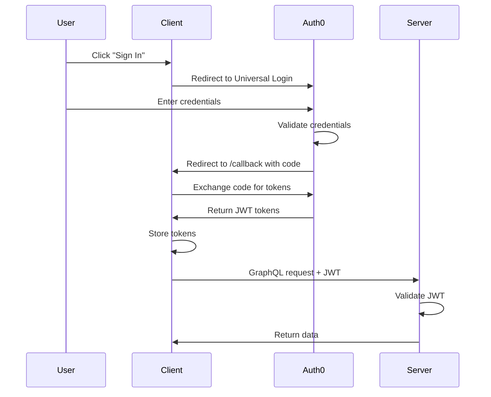
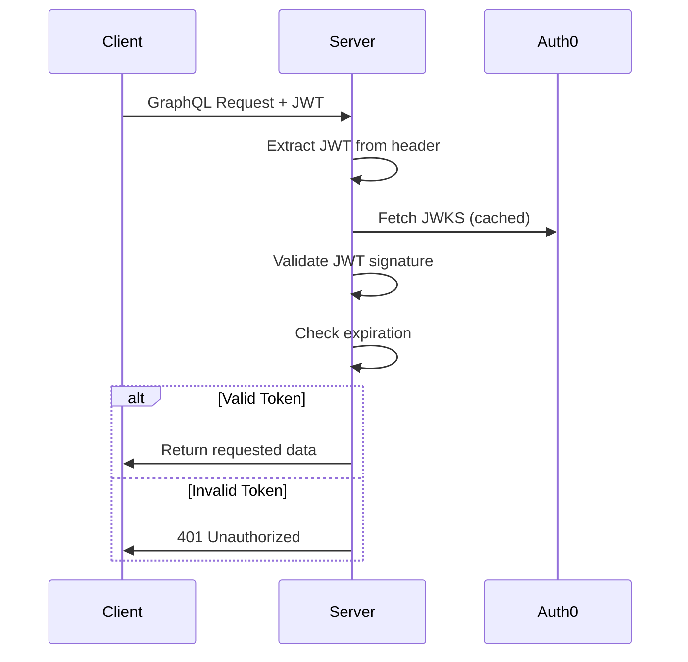

# d4: System Architecture

## 1. High-Level Architecture

```
┌─────────────────────────────────────────────────────────────────────┐
│                           CLIENT (React + Vite)                      │
│  ┌─────────────────────────────────────────────────────────────────┐ │
│  │  Pages: Landing | Callback | Dashboard                          │ │
│  │  ├── Auth0 Provider (auth context)                              │ │
│  │  ├── Apollo Client (GraphQL)                                    │ │
│  │  └── Protected Route Guard                                       │ │
│  └─────────────────────────────────────────────────────────────────┘ │
└────────────────────────────────┬────────────────────────────────────┘
                                 │ HTTPS + JWT
                                 ▼
┌─────────────────────────────────────────────────────────────────────┐
│                          SERVER (NestJS)                             │
│  ┌─────────────────────────────────────────────────────────────────┐ │
│  │  GraphQL API (Apollo Server)                                    │ │
│  │  ├── Auth Guard (JWT validation)                                │ │
│  │  ├── Books Resolver (queries + mutations)                       │ │
│  │  └── Books Service (business logic)                              │ │
│  └─────────────────────────────────────────────────────────────────┘ │
│  ┌─────────────────────────────────────────────────────────────────┐ │
│  │  Data Layer                                                      │ │
│  │  ├── TypeORM / Prisma                                           │ │
│  │  └── SQLite Database                                             │ │
│  └─────────────────────────────────────────────────────────────────┘ │
└───────────────────────────────────────────────────────────────────── ┘
                                 │
                                 ▼
┌─────────────────────────────────────────────────────────────────────┐
│                           AUTH0 (External)                           │
│  ├── User Database                                                   │
│  ├── Universal Login                                                 │
│  └── JWT Token Issuance                                              │
└─────────────────────────────────────────────────────────────────────┘
```

---

## 2. Authentication Flow

### 2.1 Login Flow


### 2.2 Token Validation Flow


---

## 3. Component Architecture

### 3.1 Frontend Structure
```
client/src/
├── main.tsx                    # App entry point
├── App.tsx                     # Root component + routing
├── components/
│   ├── auth/
│   │   ├── AuthProvider.tsx    # Auth0 context wrapper
│   │   ├── ProtectedRoute.tsx  # Route guard component
│   │   └── AuthButtons.tsx     # Login/Logout buttons
│   ├── books/
│   │   ├── BookTable.tsx       # Book list table
│   │   ├── BookForm.tsx        # Add/Edit form modal
│   │   └── BookCard.tsx        # Mobile card view
│   └── ui/
│       ├── Modal.tsx           # Reusable modal
│       ├── Button.tsx          # Styled button
│       ├── Input.tsx           # Form input
│       └── Toast.tsx           # Notification toast
├── pages/
│   ├── Landing.tsx             # Public landing page
│   ├── Callback.tsx            # Auth0 callback handler
│   └── Dashboard.tsx           # Protected dashboard
├── lib/
│   ├── apollo.ts               # Apollo Client setup
│   ├── graphql/
│   │   ├── queries.ts          # GraphQL queries
│   │   └── mutations.ts        # GraphQL mutations
│   └── types.ts                # TypeScript types
└── hooks/
    ├── useBooks.ts             # Book CRUD hook
    └── useAuth.ts              # Auth helper hook
```

### 3.2 Backend Structure
```
server/src/
├── main.ts                     # NestJS bootstrap
├── app.module.ts               # Root module
├── auth/
│   ├── auth.module.ts          # Auth module
│   ├── jwt.strategy.ts         # Passport JWT strategy
│   └── jwt-auth.guard.ts       # Auth guard
├── books/
│   ├── books.module.ts         # Books module
│   ├── books.resolver.ts       # GraphQL resolver
│   ├── books.service.ts        # Business logic
│   ├── book.entity.ts          # TypeORM entity
│   └── dto/
│       ├── create-book.input.ts
│       └── update-book.input.ts
└── graphql/
    └── schema.gql              # Generated schema (code-first)
```

---

## 4. Data Flow

### 4.1 Query Flow (Get Books)
```
Client                          Server
  │                               │
  │  query { books { id ... } }   │
  ├──────────────────────────────►│
  │                               │
  │            ┌──────────────────┤
  │            │ JWT Guard        │
  │            │ validates token  │
  │            └──────────────────┤
  │                               │
  │            ┌──────────────────┤
  │            │ Books Resolver   │
  │            │ calls Service    │
  │            └──────────────────┤
  │                               │
  │            ┌──────────────────┤
  │            │ Books Service    │
  │            │ queries SQLite   │
  │            └──────────────────┤
  │                               │
  │  { data: { books: [...] } }   │
  ◄───────────────────────────────┤
```

### 4.2 Mutation Flow (Create Book)
```
Client                          Server
  │                               │
  │  mutation { createBook(...) } │
  ├──────────────────────────────►│
  │                               │
  │            ┌──────────────────┤
  │            │ 1. JWT Guard     │
  │            │ 2. Validation    │
  │            │ 3. Create Book   │
  │            │ 4. Return Entity │
  │            └──────────────────┤
  │                               │
  │  { data: { createBook: ... }} │
  ◄───────────────────────────────┤
```

---

## 5. Security Architecture

### 5.1 Authentication Layers
```
┌─────────────────────────────────────────┐
│ Layer 1: Auth0 Universal Login          │
│ - User credentials never touch our app  │
│ - MFA support (if configured)           │
└─────────────────────────────────────────┘
                 ▼
┌─────────────────────────────────────────┐
│ Layer 2: JWT Tokens                     │
│ - Short-lived access tokens             │
│ - Signed with RS256                     │
└─────────────────────────────────────────┘
                 ▼
┌─────────────────────────────────────────┐
│ Layer 3: Backend Guard                  │
│ - Validates token on every request      │
│ - Checks expiration                     │
│ - Verifies signature against JWKS       │
└─────────────────────────────────────────┘
```

### 5.2 CORS Configuration
```typescript
// Allowed origins
{
  origin: [
    'http://localhost:5173',        // Dev frontend
    'https://your-app.netlify.app'  // Prod frontend
  ],
  credentials: true
}
```

---

## 6. Deployment Architecture

```
┌───────────────────────────────────────────────────────────────┐
│                        PRODUCTION                              │
├───────────────────────────────────────────────────────────────┤
│                                                                │
│   ┌─────────────────────┐      ┌─────────────────────────┐    │
│   │  Netlify            │      │  Render / Fly           │    │
│   │  ├── React Build    │ ───► │  ├── NestJS Server      │    │
│   │  └── Static Assets  │      │  ├── SQLite (file)      │    │
│   │                     │      │  └── GraphQL Endpoint   │    │
│   └─────────────────────┘      └─────────────────────────┘    │
│            │                              │                    │
│            │                              │                    │
│            └──────────────┬───────────────┘                    │
│                           ▼                                    │
│                  ┌──────────────────┐                          │
│                  │     Auth0        │                          │
│                  │  (Cloud Service) │                          │
│                  └──────────────────┘                          │
│                                                                │
└───────────────────────────────────────────────────────────────┘
```

---

## 7. Environment Configuration

### 7.1 Frontend (.env)
```env
VITE_AUTH0_DOMAIN=your-tenant.auth0.com
VITE_AUTH0_CLIENT_ID=your-client-id
VITE_AUTH0_AUDIENCE=https://your-api-identifier
VITE_API_URL=http://localhost:3000/graphql
```

### 7.2 Backend (.env)
```env
AUTH0_ISSUER_URL=https://your-tenant.auth0.com/
AUTH0_AUDIENCE=https://your-api-identifier
DATABASE_PATH=./data/books.sqlite
PORT=3000
```
