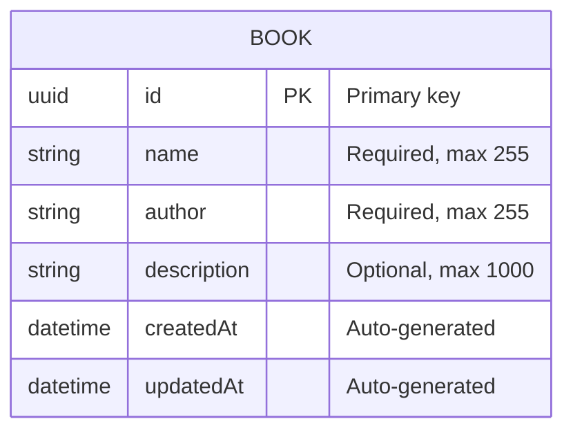

# d6: Data Model

## 1. Entity Relationship Diagram



> **Note**: MVP has a single entity. Auth is handled by Auth0 (no User table needed).

---

## 2. Book Entity Schema

### 2.1 SQLite Table Definition
```sql
CREATE TABLE books (
    id TEXT PRIMARY KEY,
    name TEXT NOT NULL,
    author TEXT NOT NULL,
    description TEXT,
    created_at TEXT NOT NULL DEFAULT (datetime('now')),
    updated_at TEXT NOT NULL DEFAULT (datetime('now'))
);

-- Index for listing (ordered by created_at)
CREATE INDEX idx_books_created_at ON books(created_at DESC);
```

### 2.2 Prisma Schema
```prisma
generator client {
  provider = "prisma-client-js"
}

datasource db {
  provider = "sqlite"
  url      = env("DATABASE_URL")
}

model Book {
  id          String   @id @default(uuid())
  name        String
  author      String
  description String?
  createdAt   DateTime @default(now()) @map("created_at")
  updatedAt   DateTime @updatedAt @map("updated_at")

  @@map("books")
}
```

---

## 3. Field Specifications

| Field | Type | Nullable | Default | Constraints |
|-------|------|----------|---------|-------------|
| `id` | UUID (string) | No | Auto-generated | Primary Key |
| `name` | String | No | - | Max 255 chars |
| `author` | String | No | - | Max 255 chars |
| `description` | String | Yes | null | Max 1000 chars |
| `createdAt` | DateTime | No | Current timestamp | Immutable after creation |
| `updatedAt` | DateTime | No | Current timestamp | Updated on each save |

---

## 4. Validation Rules

### 4.1 Backend Validation (NestJS + class-validator)
```typescript
import { IsNotEmpty, IsString, MaxLength, IsOptional } from 'class-validator';

export class CreateBookInput {
  @IsNotEmpty({ message: 'Name is required' })
  @IsString()
  @MaxLength(255, { message: 'Name must be 255 characters or less' })
  name: string;

  @IsNotEmpty({ message: 'Author is required' })
  @IsString()
  @MaxLength(255, { message: 'Author must be 255 characters or less' })
  author: string;

  @IsOptional()
  @IsString()
  @MaxLength(1000, { message: 'Description must be 1000 characters or less' })
  description?: string;
}
```

### 4.2 Frontend Validation (Zod)
```typescript
import { z } from 'zod';

export const bookSchema = z.object({
  name: z.string()
    .min(1, 'Name is required')
    .max(255, 'Name must be 255 characters or less'),
  author: z.string()
    .min(1, 'Author is required')
    .max(255, 'Author must be 255 characters or less'),
  description: z.string()
    .max(1000, 'Description must be 1000 characters or less')
    .optional(),
});

export type BookFormData = z.infer<typeof bookSchema>;
```

---

## 5. Database Operations (Prisma)

### 5.1 Create Book
```typescript
async create(input: CreateBookInput): Promise<Book> {
  return this.prisma.book.create({
    data: input,
  });
}
```

### 5.2 Find All Books
```typescript
async findAll(): Promise<Book[]> {
  return this.prisma.book.findMany({
    orderBy: { createdAt: 'desc' },
  });
}
```

### 5.3 Find Book by ID
```typescript
async findOne(id: string): Promise<Book | null> {
  return this.prisma.book.findUnique({
    where: { id },
  });
}
```

### 5.4 Update Book
```typescript
async update(id: string, input: UpdateBookInput): Promise<Book | null> {
  return this.prisma.book.update({
    where: { id },
    data: input,
  });
}
```

### 5.5 Delete Book
```typescript
async remove(id: string): Promise<boolean> {
  await this.prisma.book.delete({
    where: { id },
  });
  return true;
}
```

---

## 6. Database Configuration

### 6.1 File Structure
```
server/
├── prisma/
│   ├── schema.prisma   # Prisma schema
│   └── dev.db          # SQLite database (gitignored)
└── src/
```

### 6.2 Environment Configuration
```env
# .env
DATABASE_URL="file:./prisma/dev.db"
```

### 6.3 Prisma Commands
```bash
# Generate Prisma Client
npx prisma generate

# Create/apply migrations
npx prisma migrate dev --name init

# Open Prisma Studio
npx prisma studio
```

---

## 7. Migration Strategy

### 7.1 Development
- Use `prisma migrate dev` for development migrations
- Auto-generates migration files with SQL

### 7.2 Production
```bash
# Apply migrations in production
npx prisma migrate deploy
```

---

## 8. Seed Data (Optional)

```typescript
// prisma/seed.ts
import { PrismaClient } from '@prisma/client';

const prisma = new PrismaClient();

async function main() {
  await prisma.book.createMany({
    data: [
      {
        name: 'The Great Gatsby',
        author: 'F. Scott Fitzgerald',
        description: 'A novel about the American Dream set in the Jazz Age.',
      },
      {
        name: '1984',
        author: 'George Orwell',
        description: 'A dystopian novel about totalitarianism and surveillance.',
      },
      {
        name: 'To Kill a Mockingbird',
        author: 'Harper Lee',
        description: 'A story of racial injustice in the American South.',
      },
    ],
  });
}

main()
  .catch(console.error)
  .finally(() => prisma.$disconnect());
```
